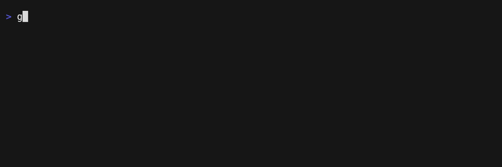

# golings

[](https://github.com/mauricioabreu/golings/actions/workflows/test.yml)


> rustlings but for golang this time

You may know [rustlings](https://github.com/rust-lang/rustlings), right? If you don't, please go ahead and check out.
`rustlings` is awesome. It is a CLI app designed to teach the awesome Rust programming language through exercises.

`golings` has the very same idea, but for the [Go programming language](https://go.dev/)

After setting up all the tools required to run `golings` you have the task to fix tiny go programs.

## Installing

First, you need to have `go` installed. You can install it by visiting the [Go downloads page](https://go.dev/dl/)

There are several ways to install `golings`

### Option 1: GO install

```sh
go install github.com/mauricioabreu/golings/golings@latest
```

Add `go/bin` to your PATH if you want to run golings anywhere in your terminal. From the official docs:

> The install directory is controlled by the GOPATH and GOBIN environment variables. If GOBIN is set, binaries are installed to that directory. If GOPATH is set, binaries are installed to the bin subdirectory of the first directory in the GOPATH list. Otherwise, binaries are installed to the bin subdirectory of the default GOPATH ($HOME/go or %USERPROFILE%\go).

#### Windows installation

Some tests depend on `CGO` which is not installed by default.

1. Install scoop package manager [Scoop Homepage](https://scoop.sh)
    ```powershell
    Set-ExecutionPolicy -ExecutionPolicy RemoteSigned -Scope CurrentUser
    Invoke-RestMethod -Uri https://get.scoop.sh | Invoke-Expression
    ```
1. Install MINGW using scoop
    ```powershell
    scoop install mingw
    ```
1. Close the Powershell session


### Option 2: Binaries

Go to the [releases page](https://github.com/mauricioabreu/golings/releases) and choose the option that best fits your environment.

### Option 3: Web version (playground)

[@Grubba27](https://github.com/Grubba27/) worked hard to create a web version: https://golings.vercel.app/

It's pretty awesome and uses the playground so you can play with the exercises without installing anything.

### Option 4: DevContainer

1. Install Docker/Podman & VSCode & Configure
1. Clone the repository and open it in VSCode.
1. You will be prompted to reopen the code in a devcontainer. The container is pre-configured with go and all of the tools needed to debug go code.
1. Open a new embeded terminal and run `golings watch` to start the exercises.

## Doing exercises

All the exercises can be found in the directory `golings/exercises/<topic>`. For every topic there is an additional README file with some resources to get you started on the topic. We really recommend that you have a look at them before you start.

Now you have the task to fix all the programs. Some of them don't compile, and you need to fix them. Some of them compile, but have tests and you need to write some code to have them all green (these are the `compile` and `test` modes).

Clone the repository:

```sh
git clone git@github.com:mauricioabreu/golings.git
```

To run the exercises in the recommended order while taking advantage of fast feedback loop, use the _watch_ command:

```sh
golings watch
```

For Windows:
```powershell
$env:CGO_ENABLED=1
golings watch
```

This command will run golings in interactive mode. Every time you save a file it will verify if the code is correct.

To run the next pending exercise:

```sh
golings run next
```

If you want to run a single exercise:

```sh
golings run variables1
```

In case you are stuck and need a hint:

```sh
golings hint variables1
```

To list all exercise while checking your progress:

```sh
golings list
```

To compile and run all the exercises:

```sh
golings verify
```

If you need help with CLI commands:

```sh
golings --help
```

A demo running the command `golings run <exercise name>`



## Contributing

See [CONTRIBUTING.md](./CONTRIBUTING.md)

## Learning resources

* [Golang official tutorial](https://go.dev/doc/tutorial/)
* [Go by example](https://gobyexample.com)
* [Aprenda Go](https://www.youtube.com/playlist?list=PLCKpcjBB_VlBsxJ9IseNxFllf-UFEXOdg)

## Other 'lings

* [rustlings](https://github.com/rust-lang/rustlings)
* [ziglings](https://github.com/ratfactor/ziglings)
